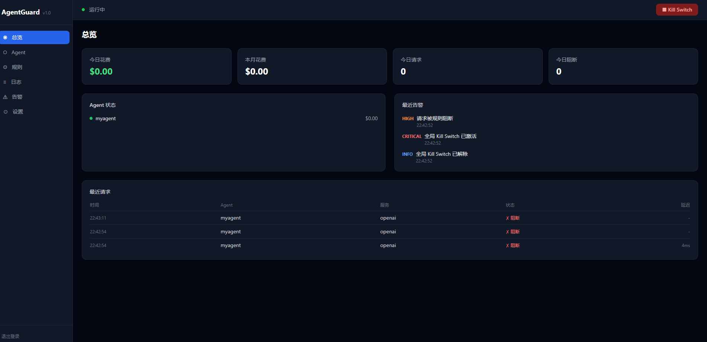

# AgentGuard

AgentGuard is a local AI Agent API security proxy gateway. It sits between AI agents and external APIs such as OpenAI, Stripe, Anthropic, and Google Ads, adding budget controls, rule checks, risk detection, audit logs, and alerts.



## Features

- Agent authentication with per-agent `ag_live_*` tokens stored as SHA-256 hashes.
- Kill switch for pausing all traffic or a single agent.
- Rule engine for budgets, per-call limits, rate limits, domain allow/deny lists, and time windows.
- Risk detection for abnormal spend, late-night high-value calls, and repeated failures.
- Audit logs with URL and header redaction.
- Alert channels for local notifications, webhooks with HMAC signatures, and email.
- Next.js dashboard for agents, logs, alerts, rules, and settings.

## Architecture

```text
AI Agent
  |
  | X-AgentGuard-Token: ag_live_xxx
  v
Proxy Server :8080
  |
  v
External APIs (OpenAI / Stripe / Anthropic / Google Ads ...)

Management API :3000
Dashboard      :3001
```

## Quick Start

### Local Development

```bash
npm install
cp packages/core/.env.example packages/core/.env

npm run dev --workspace=packages/core
npm run dev --workspace=packages/dashboard
```

Open `http://localhost:3001` and set the initial dashboard password.

### Docker

Set a strong JWT secret before starting the stack:

```bash
JWT_SECRET="$(openssl rand -hex 32)" docker-compose up -d
```

Services are bound to localhost by default:

- Dashboard: `http://localhost:3001`
- Management API: `http://localhost:3000`
- Proxy: `http://localhost:8080`

## OpenClaw Integration

Create an agent in the dashboard, optionally store the upstream API key, and use the returned AgentGuard token as the provider API key.

```json
{
  "providers": {
    "openai": {
      "baseUrl": "http://localhost:8080/proxy/openai",
      "apiKey": "ag_live_xxxxxxxxxxxxxxxx"
    }
  }
}
```

For tools that do not support custom `baseUrl`, send the AgentGuard token explicitly:

```http
POST http://localhost:8080/proxy/openai/v1/chat/completions
X-AgentGuard-Token: ag_live_xxx...
Authorization: Bearer <your-upstream-api-key>
```

Built-in service aliases:

- `openai` -> `https://api.openai.com`
- `anthropic` -> `https://api.anthropic.com`
- `stripe` -> `https://api.stripe.com`
- `google-ads` -> `https://googleads.googleapis.com`

## Environment

| Variable | Default | Description |
| --- | --- | --- |
| `PORT` | `3000` | Management API port |
| `PROXY_PORT` | `8080` | Proxy port |
| `BIND_ADDRESS` | `127.0.0.1` | Bind address |
| `DB_PATH` | `./data/agentguard.db` | SQLite database path |
| `JWT_SECRET` | generated locally if empty | JWT signing secret |

For Docker Compose, `JWT_SECRET` is required and no insecure default is provided.

## Project Layout

```text
AgentGuard/
  packages/
    core/        Node.js/TypeScript API and proxy
    dashboard/   Next.js management UI
  image/
  docker-compose.yml
  package.json
```

## License

AgentGuard is released under the MIT License. See [LICENSE](LICENSE) and [NOTICE](NOTICE).
